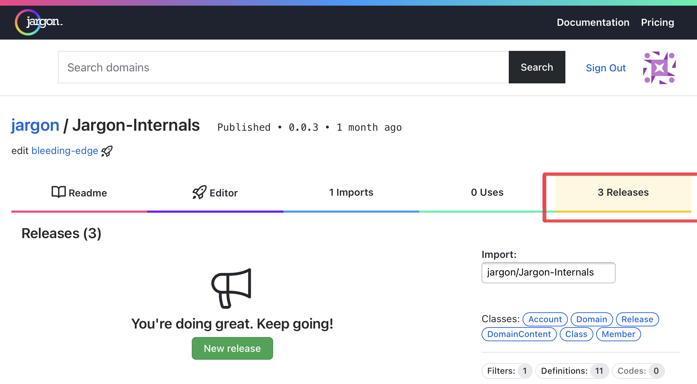

# Creating a Release 

---

Releases are how you share your Domains with others, and allows Jargon users to quickly build upon the work of the community.

## Creating a Release

### You can't go back from this

!> You can't unpublish a Release. Be sure that you're comfortable with this Release existing forever on the internet. 

    
1. Go to the Details page of the Domain you want to Release 
2. Click the 'Releases' tab, then the 'New Release' button

3. On the Create Release screen, fill in the form as follows:
- the semantic **Version** number of this release
- the **Description** of the Domain, which updates what people will see when they search or browse for this Domain
- the **Release Notes** for this version, which are written in [markdown](https://www.markdownguide.org). You can click the 'Preview' tab to see what your Release Notes will look like to others. 
4. Click 'Create Release'

