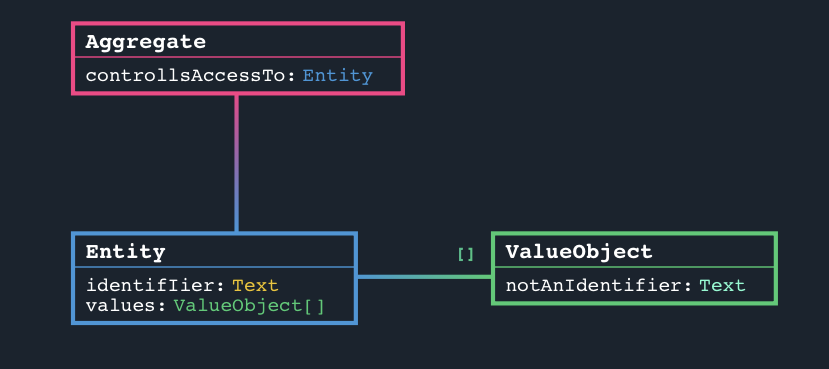

# The Jargon Language 

Jargon Domains are written in code - and for a couple of good reasons:
- It's really quick to create and edit Domains
- It's simple to learn, and there aren't a lot of complicated UI screens and buttons to learning
- It's easy to work out and show what has changed between versions

?> Don't be afraid if you have no experience writing code - Jargon is very quick and simple to understand. You can get more information by looking at the documentation for the [Jargon Editor](/pages/the_jargon_editor) 


## A Simple Example

Here is a Domain with only two Classes: Driver and Car.
Drivers have an Id and are assigned a Car, which has a registration number.

> The **Colours** you can see below are important, but ignore them for now. We'll cover them in [Colours and Class Types](/pages/language?id=colours-and-class-types)

```jargon

---
Driver
 ^id:Text
 assignedCar:Car

Car
 registration:Text
```

The [Jargon Editor](/pages/the_jargon_editor) will create an image of this Domain for you, which will look something like this:


## Classes

You create a Class by typing the name on it's own line, without any indendation.

```jargon

---
Fruit

Animal

Person
```

You can also create a class that is a sub-Class of another Class, by adding ':' and the super-Class name.

A sub-Class will have all the Properties of it's parent Class.

```jargon

---
Person
 name:Text
 age:Numeric

Employee:Person

```


## Properties 

You give a Class some Properties, by typing them on their own line, underneath the Class you want them to be part of, indented by 1 or more spaces.

Each property has a Name and a Type, separated by a ':'

```jargon

---
Fruit
    colour:Text
    quantity:Numeric

Animal
    hasFur:Indicator

Person
    age:Numeric
```


## Identifiers

Some Properties of a Class can be used to uniquely adderss an instance of that Class from others.

You make a Property an Identifier, by starting it's Name with '^'.

A Class can have multiple Identifiers.


```jargon

---
Employee
    ^identificationNumber:Numeric

SpreadsheetCell
    ^row:Numeric
    ^column:Numeric
    content:Text
```


> Woah! Why did all those Classes turn blue?
> 
> A class that has Identifiers becomes what Jargon calls an 'Entity'. We'll cover them soon in [Colours and Class Types](/pages/language?id=colours-and-class-types)


?> Identifiers, and Addressability are really important to Jargon, and successfully using Domains from others. 

## Arrays

A Class can have an array of a property, by placing [] after the Property's Type:

```jargon

---
Person
    luckyNumbers:Numeric[]
```

## Importing from other Domains

You can import Classes or Properties from other Domains into yours, but only after you have [Imported](/pages/intro_to_releases_and_importing?id=about-importing) it first.

Each domain you Import is given an Alias, which ensures that you don't have any problems if you're importing something with the same name as one of your Classes.

Assuming you had imported a Domain with the alias of 'payroll', you could use either a Class or a Property from that Domain by:


```jargon
i:mock.mock:mock as payroll
ic:payroll.EmployeeTypes
---
Employee
	^number:Numeric
	wagePlan:payroll.Wage
	scheme:payroll.Scheme.legislation
    type:Code(payroll.EmployeeTypes)
```


***Payroll Domain***
```jargon

---
Wage
 quantity:Numeric
 frequencyDays:Numeric
    
Scheme
    legislation:Text
```

### The 'this' alias

Jargon allows you to refrence Clases and Properties from the current Domain as if it was an imported Domain.

Here's how that works:

```jargon

---
Common
 senderRef:Text


CTOReceival
 ^senderRef:this.Common.senderRef

```

## Supported Data Types

Jargon supports a very limited number of DataTypes that your Properties can have - and that's deliberate.

Overloading business-rules and meaning into DataTypes makes it really difficult to later extract that information and do something useful with it.

Jargon handles this through [Business Rules](/pages/business_rules).

```jargon
c:SomeListOfValues
---
DataTypes
    anyTypeOfNumber:Numeric
    integer:Integer
    withDecimalPoint:Decimal
    anyText:Text
    date:Date
    dateWithTime:DateTime
    websiteURI:URI
    email:Email
    trueOrFalse:Indicator
    selectFromAList:Code(SomeListOfValues)
    unwantedPropertyFromSuperClass:Unset

```

> Unset?
>
> There may be circumstances when you've imported a super class from another domain that has properties you don't want.
> You can either re-declare them, by setting them to something else, or you can give them the datatype of 'Unset' which removes them from the class completely.
>

> Hey, what's that stuff after Code?
>
> Jargon manages Codes a little differently than you might be used to. The set of valid values a Property can take is often called Reference Data - and it's usually a finite set of values - 01, CUR, AUS, ... . The problem with this approach is that it requires everyone you share data with to accept and use your choice of representing that Reference Data. You can read more about how Jargon does this better with [Code Tables](/pages/code_tables)


## Colours and Class Types

A Domain in Jargon doesn't just model the structure of the data, but also how that data is Addressed and accessed - which is a common problem in Software Engineering.

Jargon is inspired by a popular solution to this problem, called  [Domain-Driven-Design](https://en.m.wikipedia.org/wiki/Domain-driven_design), and shares many of the same concepts.

There are three types of Class in Jargon, each with a different approach to how instances of that Class are Addressed.

### Example

```jargon

---
Entity
 ^identifIier:Text
 values:ValueObject[]
 
ValueObject
 notAnIdentifier:Text
 
Aggregate
 getsIdentifiersFrom:Entity
```




## Entity

An Entity is a Class that has Identifiers, and is represented by the colour <span class="jargon_Entity" style="font-weight:bold;">Blue</span>.

```jargon
c:Suits
---
PlayingCard
 ^value:Numeric
 ^suit:Code(Suits)
```

If you had a deck of playing cards, you can Address every single card in the deck with the combination of it's value and suit, eg: the 6 of Hearts.

## ValueObject

A ValueObject is a Class that has no Identifiers, and is represented by the colour <span class="jargon_ValueObject" style="font-weight:bold;">Green</span>.

There is no way to uniquely address a ValueObject.

Whenever you access an Entity, it has access to all of it's ValueObjects.


```jargon

---
BankAccount
 ^number:Numeric
 transatctions:Transaction[]

Transaction:
 value:Numeric

```


## Aggregate 

An Aggregate is a Class that has no Identifiers of it's own and derrives it's business-identity from it's child Properties, and is represented by the colour <span class="jargon_Aggregate" style="font-weight:bold;">Pink</span>.


```jargon

---
Transaction:
 #hideClass
 value:Numeric
 log:LogEntry

LogEntry:
 ^timestamp:Text
 ^id:Text

```

# Processing Instructions

Jargon supports several processing instructions that don't change the semantics of your domain, but influence how the data model diaram is generated.

Processing instructions look a lot like members, except they all start with a #


```jargon

---
Shipment:
 #important
 ^id:Numeric

```

Here's a list of the currently supported processing instructions:

- **#important** - highlights this class, making it stand out from the rest of the classes
- **#additionalRows:n** - adds n additional rows to the class, making it vertically larger
- **#shortImports** - removes some of the prefix information on imported properties, making the classes less short and wide 
- **#hideClass** - removes this class from the diagram. Useful for any mechanical classes that don't add to the understanding of the Domain 


Here's a list of the currently supported processing instructions:

- **#important** - highlights this class, making it stand out from the rest of the classes
- **#additionalRows:n** - adds n additional rows to the class, making it vertically larger
- **#shortImports** - removes some of the prefix information on imported properties, making the classes less short and wide 
- **#hideClass** - removes this class from the diagram. Useful for any mechanical classes that don't add to the understanding of the Domain 

# Comments 

You can comment out parts of the model, or leave notes within your model, by using comments.


Comments either operate on an entire line, by starting that line with '//'.
You can also comment out many lines, by using /* and */


<div class="jargon_code"><pre><code>
<span class="jargon_comment">// Comments aren't included in your models</span>
<span class="jargon_class jargon_Entity">Shipment</span>
 <span class="jargon_processingInstruction">#important</span>
 ^id:<span class="jargon_Identifier">Numeric</span>
  <span class="jargon_comment">//date:Date</span>

<span class="jargon_comment">\/\*</span>
<span class="jargon_comment">multiple lines</span>
<span class="jargon_comment">can be commented out</span>
<span class="jargon_comment">like this</span>
<span class="jargon_comment">\*\/</span>

</code>
</pre>
</div>


---
