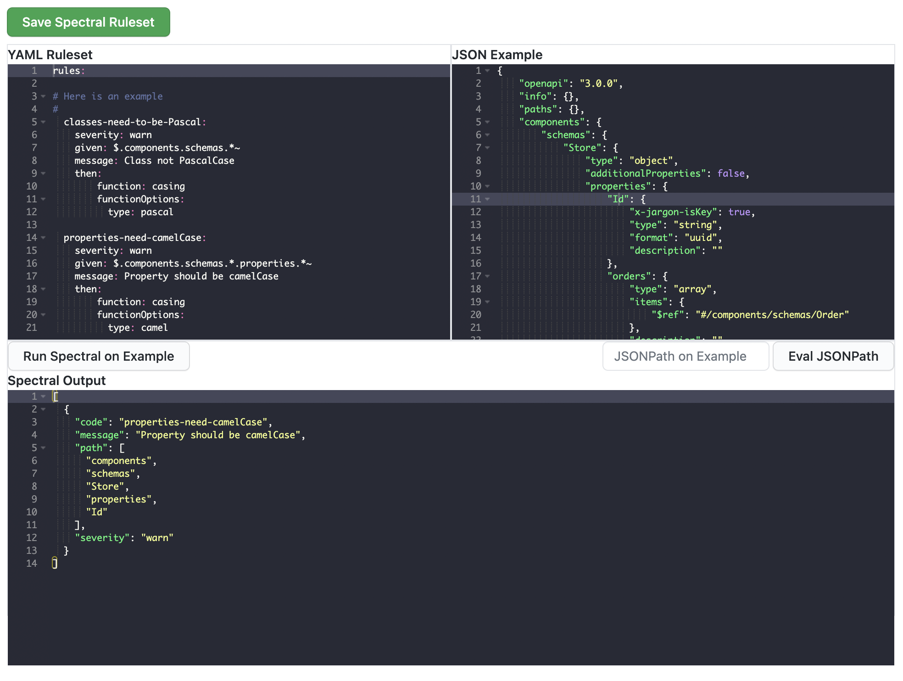

# Spectral Rulesets 

---

Jargon supports [Spectral](https://github.com/stoplightio/spectral) Rulesets that can be used to validate your Domains and API specifications 

Spectral rules can be applied at three diffrent layers:

1. Domain by Domain. Note: You can only select from Jargon's internal curated list of rulesets when applying them to a single Domain
2. User and Teams. Teams and Users on the private plan can create custom Spectral Rulesets that will apply to all of their Domains, unless that Domain has selected to use a specific Ruleset
3. Enterprise wide. Enterprise installations can create custome Spectral Rulesets that will apply to all Domains within the installation, unless they are in an account that has specified their own custom Ruleset, or an individual Domain that has selected a Ruleset.


## How to create a custom Spectral Ruleset

*For Enterprise Users* - the Spectral Editor is available in the management console. You may need to talk to your Jargon Administrator to get access.

*For Team and Private Users* - the Spectral Editor is available in the User / Team settings page

Jargon contains an IDE for developing and testing Spectral Rulesets, which looks like this:




Your rules go into the top-right pane, labelled: YAML Ruleset

You can provide an example JSON OpenAPI specification to test the ruleset on in the top-left pane, labelled: JSON Example

The bottom pane will show the results of your Spectral Ruleset whenever you click the 'Run Spectral on Example' Button

Optionally, you can evaluate a JSON Path Plus expression (which is how Spectral rules target specific parts of the JSON Document) by entering it into the 'JSONPath on Example' text box, and clicking the 'Eval JSONPath' button.


## Support for Spectral's Core Functions

Jargon supports a subset of Spectral's [Core Functions](https://docs.stoplight.io/docs/spectral/cb95cf0d26b83-core-functions)

**Supported**

- alphabetical
- enumeration
- falsy
- length
- pattern
- casing
- truthy
- defined
- undefined

**Unsupported**

- schema
- unreferencedReusableObject
- xor
- typedEnum


### Jargon's internal curated list of Spectral Rulesets

If you would like to add a new Ruleset to this list, reach out via the [Jargon Issue Tracker](https://github.com/jargon-sh/issues/issues)

## Australian Government - api.gov.au 

```yaml
rules:
  
   # A collection of API design rules from the
   # Australian Government's National API
   # Design System : https://api.gov.au
  
     class-names-should-be-PascalCase:
       severity: warn
       given: $.components.schemas.*~
       message: Class names must be PascalCase
       then:
           function: casing
           functionOptions:
             type: pascal
 
    property-names-must-be-camelCase:
      severity: warn
      given: $.components.schemas.*.properties.*~
      message: Property names must be PascalCase
      then:
          function: casing
          functionOptions:
            type: camel
 
```


## Red Hat - Developer


```yaml

#adapted from https://github.com/redhat-developer/app-services-api-guidelines/blob/main/spectral/ruleset.yaml

rules:
  openapi-tags: off
  operation-tags: off
  oas3-valid-schema-example: warn
  no-$ref-siblings: warn
  oas3-valid-media-example: warn

  rhoas-oas3minimum:
    given: "$"
    description: OpenAPI version must be >= 3
    recommended: true
    severity: warn
    then:
      field: openapi
      function: pattern
      functionOptions:
        match: 3.[0-9]?.[0-9]

  rhoas-path-regexp:
    given: "$.paths[*]~"
    severity: warn
    message: API paths must match /api/ then a version
    description:
      OpenAPI paths must start with `/api/`, followed by a version. All paths
      must follow snake_case
    then:
      function: pattern
      functionOptions:
        match: "\/api\/.*$"
        
  rhoas-response-media-type:
    given: "$.paths.*.*.responses.*.content"
    description: application/json is the only acceptable content type
    severity: warn
    then:
      function: truthy
      field: application/json
  
  rhoas-schema-name-pascal-case:
    description: JSON Schema names should use PascalCase
    message: "`{{property}}` object name must follow PascalCase"
    severity: error
    given: "$.components.schemas[*]~"
    then:
      function: pattern
      functionOptions:
        match: "^([A-Z]{1}[a-z]{1,}){1,}$"
        
  rhoas-schema-properties-snake-case:
    description:
      All JSON Schema properties MUST follow snake_case and be ASCII alphanumeric
      characters.
    severity: error
    recommended: true
    message: "`{{property}}` MUST follow snake_case and be ASCII alphanumeric characters."
    given: "$.components.schemas..properties[*]~"
    then:
      function: pattern
      functionOptions:
        match: "/^[a-z0-9_]{1,}/"
  
  rhoas-operaton-id:
    severity: warn
    recommended: true
    given: "$.paths.*.*"
    then:
      function: truthy
      field: operationId

```

