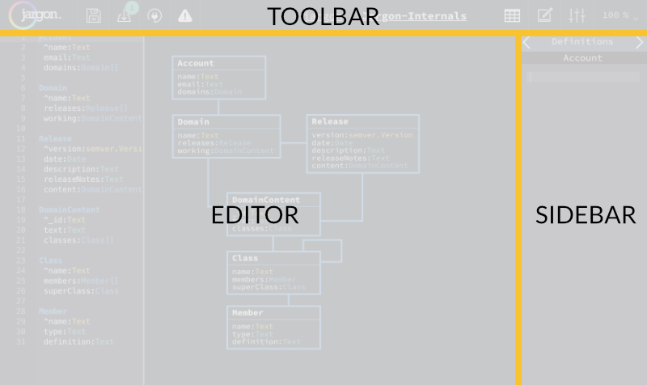

# The Jargon Editor 

---

Creating Domains using Jargon is pretty straight forward, but there are some things to look out for if you're not familiar with it.

## Overview of the Editor

The Jargon Editor has three areas of focus:

1. Editor - where you create and edit the structure of your Domain
2. Sidebar - where you update specific details of the Domain, like Definitions, Code Tables, Business Rules and Filters
3. Toolbar - where you interact with the Domain, by saving, importing, changing the view, etc:
 - Alert buttons are shown here, and look like this:

   

   Each icon will show the relevant number of things, or blank if none.

   From the left, the icons represent:
   - the number of **Imports**. Clicking here will let you add or delete Imports
   - the number of **Zombies** (discussed below). Clicking here will let you revive any Classes that you have removed
   - the number of **Messages**. Clicking here will show you any messages that Jargon has about your Domain 
 - Sidebar buttons, that change what the sidebar does:

   

   From the left, the buttons are:
    - [Code Tables](/pages/code_tables)
    - [Data Definitions](/pages/data_definitions)
    - [Filters](/pages/filtering)

### Editing the Domain

You will spend most of your time in the Editor area, where you type and layout your Domains.

As you type the [Jargon Language](/pages/language) on the left, the diagram will update on the right. Following the auto classification of Domain Driven Design Class types, the colours here will update in real-time as you type.

Once you have a few Classes, spend a little time dragging them around to help make your Domain clearer to understand. Jargon will atttempt to route the connection lines intelligently, but it's not perfect so you might have to try a few different layouts before you find something you like.

## Some notes on a text-first approach

Because Jargon Domains are described with text, there are a few compromises that have been made to the editing experience.

1. Renaming things - If you change the name of something in the text editor, Jargon will attempt to detect and apply that name change everywhere throughout the Editor, but sometimes things get missed.
2. Cutting and Pasting - If ever you remove a chunk of the text, Jargon will try to remember all the other details about the Classes and Properties you removed, like definitions and layouts. Whenever Jargon is remembering details of things you've removed, the exclamation mark icon in the toolbar will show the number of things being remembered. These remembered things are called Zombies, and you can read about how they work below.

## When Things Go Wrong

Jargon will constantly check your Domain for issues, and will let you know if there is anything you need to fix.

You will easily be able to see if there are any messages by looking at the Message Alert button in the toolbar. It will show you how many messages there are, or will be blank if there are none. Clicking the button will list the messages for you.

## Creating and Reviving Zombies

If you ever remove a Class (or Classes) from the Editor, Jargon will remember their details and layout location. This is called a Zombie - a Class with interesting information that has been removed from the editor, but can still be revived.

This will happen for cut and pasting, and whenever you want to delete a Class.

Whenever Jargon thinks that you've revived one of the zombies that it's remembering, it will automatically forget that zombie. If you're about to save the Domain you should make sure that there are no zombie Classes that you want to revive.

!> Once you close the tab, or refresh the page, Jargon will forget the zombies and their information will be lost.
